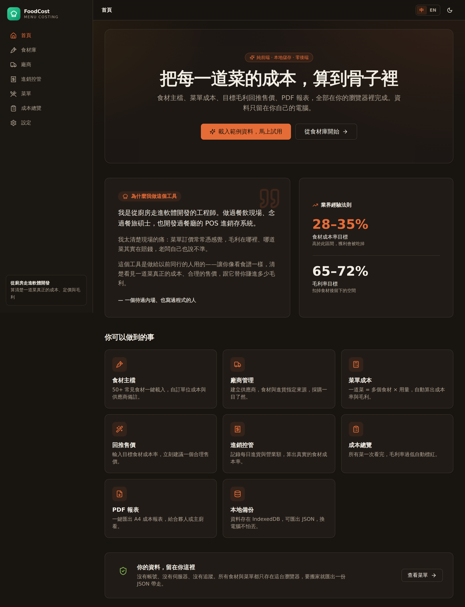
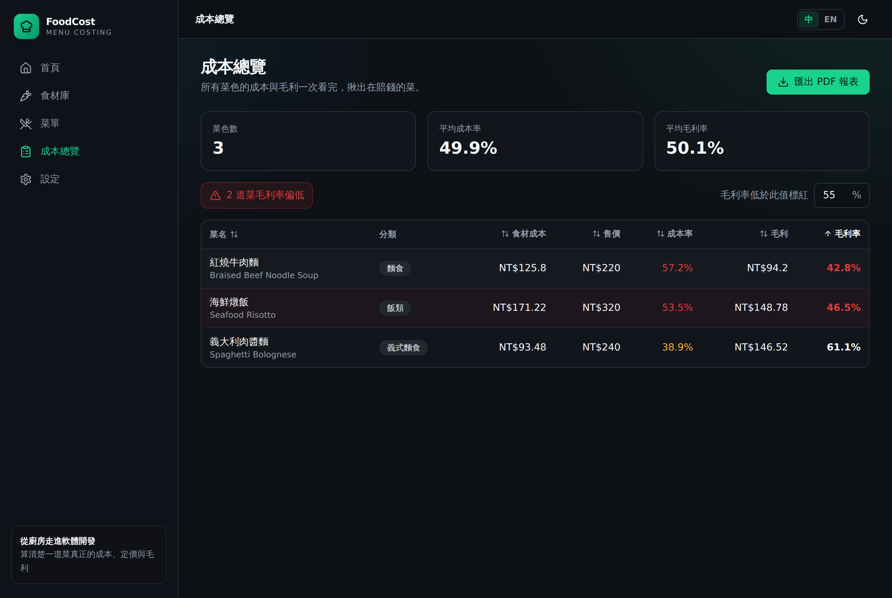
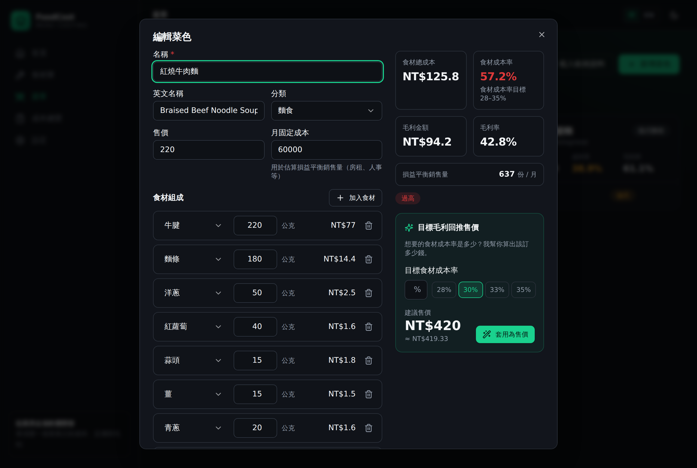
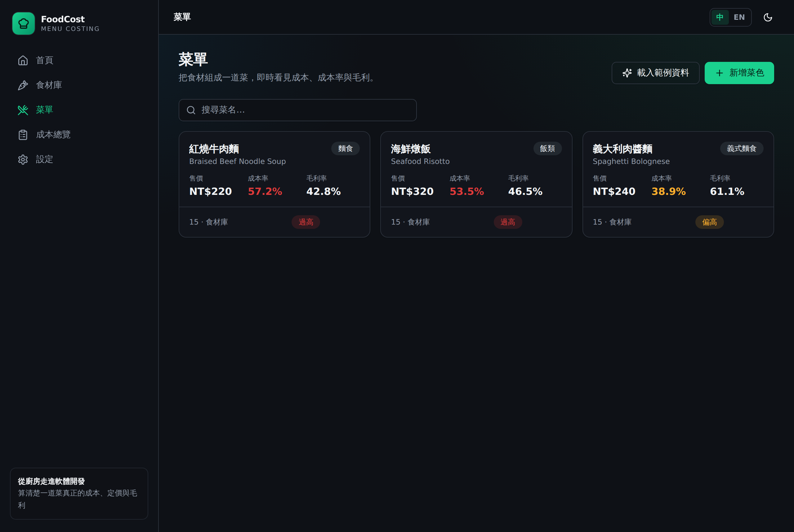
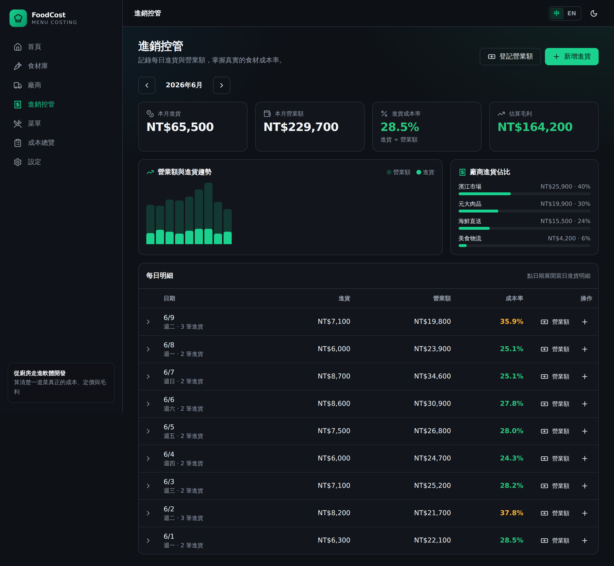
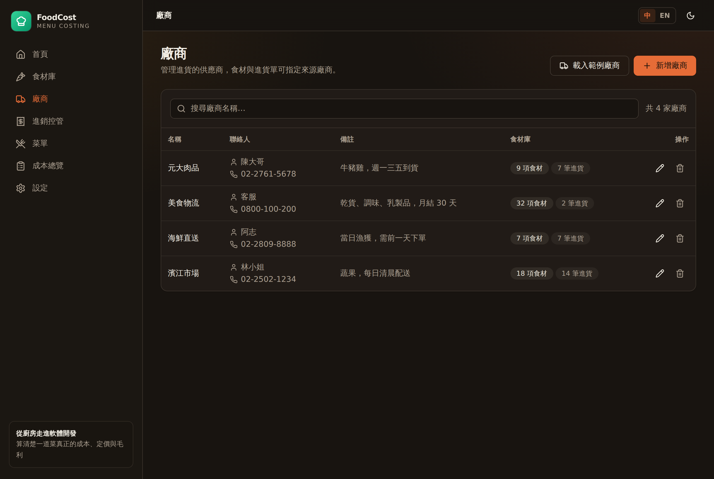
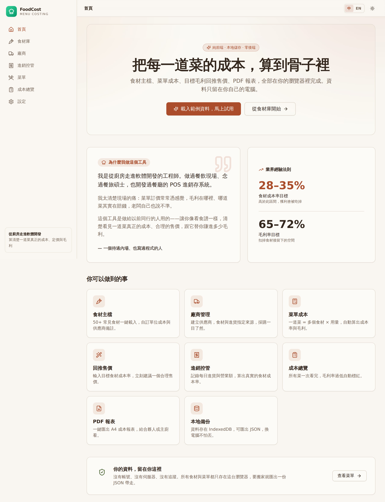

<div align="center">


# 餐廳菜單成本計算器 · FoodCost

**算清楚一道菜真正的成本、定價與毛利。**
給餐廳老闆、廚師、開店者用的菜單成本工具。

純前端 · 本地儲存 · 零後端 · 可離線 · 一鍵部署 GitHub Pages

[功能](#-核心功能-features) · [使用情境](#-使用情境-use-cases) · [快速開始](#-快速開始-getting-started) · [部署](#-部署-deployment) · [技術棧](#-技術棧-tech-stack)

</div>

---

## 🧑‍🍳 為什麼做這個工具（開發者的故事）

> 我是**從廚房走進軟體開發**的工程師。做過餐飲現場、念過餐旅碩士，也開發過餐廳的 POS 進銷存系統。
>
> 我太清楚現場的痛：菜單訂價常常憑感覺，毛利在哪裡、哪道菜其實在賠錢，老闆自己也說不準。
>
> 這個工具是做給以前同行的人用的——讓你像看食譜一樣，清楚看見一道菜真正的成本、合理的售價，跟它替你賺進多少毛利。
>
> — 一個待過內場、也寫過程式的人

*An engineer who came up through the kitchen built this for the people still in it — so you can read a dish like a recipe and see its real cost, a sensible price, and exactly how much margin it earns.*

---

## 📸 畫面 Screenshots

| 首頁（開發者故事 + 業界基準） | 成本總覽（自動標紅在賠錢的菜） |
| :--: | :--: |
|  |  |

| 菜色編輯（即時成本 + 回推售價） | 菜單卡片總覽 |
| :--: | :--: |
|  |  |

| 進銷控管（每日進貨 × 營業額 × 成本率） | 廠商主檔 |
| :--: | :--: |
|  |  |

| 大地色系淺色主題 Earth-tone light theme |
| :--: |
|  |

---

## ✨ 核心功能 Features

- **食材主檔 Ingredient master** — 名稱、單位（公克／毫升／個／份）、單位成本、**可指定來源廠商**；內建 **60+ 常見食材**（牛腱、雞胸、洋蔥、橄欖油、番紅花…）可一鍵載入。
- **廠商主檔 Suppliers** — 建立供應商（聯絡人、電話、備註），食材與進貨單可指定來源，採購來源一目了然。
- **菜單主檔 Menu master** — 一道菜 = 多個食材 × 用量，自動計算：
  - 食材總成本
  - **食材成本率**（成本 ÷ 售價，業界目標 **28–35%**）
  - 毛利金額、毛利率
  - **損益平衡銷售量**（給定月固定成本）
- **目標毛利回推售價 Reverse pricing** — 輸入「我想要 30% 食材成本率」→ 自動建議一個合理售價（並進位到好開的價格）。
- **成本總覽 Overview** — 所有菜的成本／售價／毛利率一次看完，可排序、可設定門檻，**毛利率過低自動標紅**。
- **進銷控管 Operations** — 逐筆記錄**每日進貨**（日期 · 廠商 · 品項 · 金額）與**當日營業額**；月報表自動算出**進貨成本率**、估算毛利、營收／進貨趨勢圖與各廠商進貨佔比。
- **匯出 PDF** — A4 菜單成本報表，含 LOGO 區、表頭、表格與頁尾，給合夥人或主廚看。
- **本地儲存 + 備份** — 全部資料存在瀏覽器的 **IndexedDB**（透過 Dexie）；可匯出／匯入 **JSON 備份**，換電腦不會丟資料。
- **體驗 UX** — SaaS 工具感、數字 `tabular-nums` 對齊、**預設深色模式（另有大地色系淺色主題：赤陶 × 橄欖 × 沙色）**、**中／英雙語切換**、桌面優先但行動裝置可用、**PWA 可離線**。

---

## 💡 使用情境 Use Cases

1. **開店前定價** — 把預計的食材建進去，用「回推售價」抓出符合 30% 成本率的價格，再參考市場微調。
2. **既有菜單體檢** — 把現有菜色全部建好，打開成本總覽，一眼看出哪幾道**其實在賠錢或毛利過低**。
3. **食材漲價後重算** — 牛肉漲了？改一個食材的單位成本，所有用到它的菜成本即時更新。
4. **每日進銷控管** — 收到貨就記一筆進貨（哪家廠商、買了什麼、多少錢），打烊登記當日營業額；月底自動看出**進貨成本率**有沒有失控、哪家廠商佔比最高。
5. **給合夥人／主廚的報表** — 一鍵匯出 A4 PDF，數字攤開來談，不再各說各話。

---

## 🚀 快速開始 Getting Started

需要 **Node.js 18+**（建議 20/22）。

```bash
# 安裝相依套件
npm install

# 啟動開發伺服器（http://localhost:5173）
npm run dev

# 型別檢查 + 產出純靜態網站到 dist/
npm run build

# 本機預覽 build 結果
npm run preview
```

第一次打開後，到**首頁**或**設定**點「**載入範例資料**」，即可載入 60+ 食材與 3 道範例菜單（紅燒牛肉麵、義大利肉醬麵、海鮮燉飯）開始試用。

---

## 📦 部署 Deployment（GitHub Pages）

本專案 `vite.config.ts` 使用 `base: "./"`（相對路徑），因此在 `https://<user>.github.io/<repo>/` 這種子路徑也能直接運作，**不需改設定**。

已附上 GitHub Actions 工作流程 `.github/workflows/deploy.yml`：

1. 將程式碼推到 GitHub。
2. 到 **Settings → Pages → Build and deployment → Source** 選擇 **GitHub Actions**。
3. 推送到預設分支即會自動 build 並部署。

或手動部署：`npm run build` 後，把 `dist/` 的內容丟到任何靜態主機（Netlify、Vercel、Cloudflare Pages、S3…）。

---

## 🔒 資料與隱私 Data & Privacy

- **沒有帳號、沒有伺服器、沒有追蹤。** 所有食材與菜單只存在你這台瀏覽器的 IndexedDB。
- 換電腦或備份：**設定 → 匯出 JSON 備份**，在新機器用**匯入**還原（可選「取代」或「合併」）。
- 安裝為 PWA 後可**離線使用**。

---

## 🛠 技術棧 Tech Stack

| 範疇 | 選用 |
| --- | --- |
| 前端框架 | **React 18 + Vite + TypeScript** |
| 樣式 / 元件 | **Tailwind CSS** + **shadcn/ui**（Radix UI）+ lucide-react |
| 本地資料庫 | **Dexie**（IndexedDB ORM）+ dexie-react-hooks（live query） |
| 表單驗證 | **React Hook Form + Zod** |
| PDF 匯出 | **jsPDF + html2canvas**（依需求動態載入，不拖累首屏） |
| 離線 / PWA | **vite-plugin-pwa**（Workbox） |
| 提示 | sonner（toast） |

---

## 🗂 專案結構 Project Structure

```
src/
├─ types.ts                 # 領域型別（Ingredient / Supplier / Purchase / MenuItem…）
├─ lib/
│  ├─ db.ts                 # Dexie 資料庫（v2：食材／菜單／廠商／進貨／營業額）+ CRUD
│  ├─ calc.ts               # 成本／成本率／毛利／回推售價（純函式）
│  ├─ operations.ts         # 進貨×營業額的每日彙整、月摘要、廠商佔比
│  ├─ dates.ts              # 日期／月份工具
│  ├─ seed.ts               # 60+ 食材、廠商、3 道菜、~2 週進銷範例
│  ├─ backup.ts             # JSON 匯出／匯入（含 id 重映射）
│  ├─ pdf.ts                # A4 報表產生（jsPDF + html2canvas）
│  ├─ format.ts             # 金額／百分比／單位格式化
│  └─ settings.tsx          # 語言／主題／貨幣 + i18n t()
├─ i18n/translations.ts     # 中英雙語字典
├─ components/ui/           # shadcn/ui 元件
├─ features/
│  ├─ home/                 # 首頁（開發者故事）
│  ├─ ingredients/          # 食材主檔（可指定廠商）
│  ├─ suppliers/            # 廠商主檔
│  ├─ operations/           # 進銷控管：每日進貨 + 營業額 + 月報表
│  ├─ menus/                # 菜單 + 成本編輯器 + 回推售價
│  ├─ overview/             # 成本總覽 + PDF 匯出
│  └─ settings/             # 設定 + 備份
└─ App.tsx
```

---

## 📐 計算邏輯 Formulas

```
食材總成本  ingredientCost = Σ (用量 × 食材單位成本)
食材成本率  foodCostRatio  = ingredientCost / price        （業界目標 28–35%）
毛利金額    grossProfit    = price − ingredientCost
毛利率      grossMargin    = grossProfit / price
損益平衡量  breakEven      = ceil(月固定成本 / 每份毛利)
回推售價    price          = ingredientCost / 目標食材成本率
進貨成本率  purchaseRatio  = 當期進貨總額 / 當期營業額總額   （進銷控管）
估算毛利    estProfit      = 營業額總額 − 進貨總額
```

---

## 📄 授權 License

[MIT](LICENSE) — 自由使用、修改、散布。歡迎餐飲同行拿去改成自己的工具。
